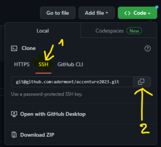

# Travailler avec GitHub

**Préambule** : tout projet public sur GitHub doit comporter un fichier `README.md` 
(au format Markdown) expliquant ce qu'est le projet.

Format Markdown général : https://www.markdownguide.org  
Format Markdown GitHub : https://github.github.com/gfm/

### Configurer Git

Dans la ligne de commande, tapez les commandes suivantes (ne pas saisir le 
caractère `$` qui est en début de ligne, il symbolise juste le _prompt_ de la 
ligne de commande) :

>`$ git config --global user.name "Prenom NOM"`  
>`$ git config --global user.email votreemail@example.com`  
>`$ git config --global core.autocrlf true`  

________________________________________________________________________________
### 1.1. Créer un nouveau repository sur GitHub

La majeure partie du temps, on crée un référentiel (aka _repository_) sur le 
site de GitHub (`Settings > Your repositories > New`) et ensuite on peut 
téléverser du contenu dedans grâce au bouton `Add file > Upload files` 
depuis n'importe quel sous-répertoire du _repository_ :

- Depuis le menu `Settings` (cliquez sur votre avatar en haut à droite), 
sélectionnez `Your repositories` :


- Sélectionnez le _repository_ sur lequel vous voulez travailler (_pas d'image_).

- Cliquez ensuite sur le bouton `Code > Upload files`.


- Vous arrivez sur une page permettant de téléverser le contenu de votre projet 
à partir d'un répertoire du disque dur. Cliquez sur le lien `choose your files` 
puis sélectionnez le répertoire ou les fichiers que vous souhaitez envoyer.


- Finissez en saisissant un message dans la partie `Commit changes` et cliquez 
sur le bouton `commit changes`.

Pour pouvoir travailler en local sur ce projet, vous devez ensuite :
- soit le cloner (cf. [1.2. Clone d'un repository GitHub](#12-clone-dun-repository-github))
- ou bien connecter un répertoire local à son URL avec la commande `git remote` 
que nous verrons au chapitre [1.3. Connecter un répertoire local à un repository GitHub](#13-connecter-un-répertoire-local-à-un-repository-github).

________________________________________________________________________________
### 1.2. Clone d'un repository GitHub

Le clonage d'un _repository_ consiste à télécharger une copie locale d'un projet
hébergé sur le site [GitHub](https://www.github.com).

>Copiez l'URL du repository sur GitHub :
>
>- Prenez la version SSH si vous pensez participer au projet,
>
>- Sinon prenez la version HTTPS si vous voulez simplement télécharger le code 
pour le lire sans jamais publier sur le repo GitHub
>
>

> Une fois l'URL copiée, tapez cette commande dans un terminal :  
>`$ git clone git@github.com:$VOTRE_LOGIN$/binomotron.git`

La commande va télécharger le contenu du référentiel et le mettre dans le 
répertoire courant.


________________________________________________________________________________
### 1.3. Connecter un répertoire local à un repository GitHub

Cette suite de commandes vous permet d'initialiser un **répertoire local** de 
votre disque dur pour qu'il devienne synchronisé avec votre _repository_ distant 
**'binomotron'** (ou binomo<b><u>n</u></b>tron selon les versions) :

> \# Commencez par vous placer dans le répertoire de votre projet (remplacez \<votre_répertoire_de_projet\> par la bonne valeur):  
> `$ cd <votre_répertoire_de_projet>`

> \# Activation/Initialisation de GIT dans le répertoire courant :  
> `$ git init`

> \# On spécifie l'URL du _repository_ distant et on lui donne un nom local 
> (remplacez `$VOTRE_LOGIN$` par votre login ^^) :  
> `$ git remote add origin git@github.com:$VOTRE_LOGIN$/binomotron</b>.git -m main -f`

> \# On **télécharge** les dernières modifications de la branche `main` :  
> `$ git pull`

Initialement, votre projet **local** ressemble à ceci :


Votre projet distant, lui, ne contient que 2 fichiers (à quelques variations près) :


________________________________________________________________________________
### 2. L'étape du _staging_

La **_staging area_**, c'est un peu comme une "zone d'embarquement" dans un 
aéroport : seuls les passagers admis dans cette zone pourront embarquer dans 
l'avion. Sauf qu'ici, les passagers ce sont nos fichiers !

- [x] travail local = les passagers sont dans l'aéroport
- [ ] **git add (staging) = les passagers vont en zone d'embarquement**
- [ ] git commit = les passagers embarquent dans l'avion
- [ ] git push = l'avion décole, arrive à destination et les passagers débarquent


Notez que cette étape ne modifie pas les fichiers sur le disque, elle permet 
simplement de désigner les fichiers et répertoires qui seront archivés lors de
la commande `commit`. Git va simplement mémoriser la liste des fichiers qu'on
lui donne lors du _staging_.

Ouvrez un terminal dans votre répertoire `binomotron` et tapez les 
commandes suivantes :

> \# Commençons par afficher un statut de Git :<br/>
>
>```
>PS D:\Java\binomotron> git status
>
>On branch main
>Untracked files:
>  (use "git add <file>..." to include in what will be committed)
>add '.gitignore'
>add '.idea/inspectionProfiles/Project_Default.xml'
>add '.idea/libraries/mysql_connector_java.xml'
>add '.idea/misc.xml'
>add '.idea/modules.xml'
>add '.idea/vcs.xml'
>add '.idea/workspace.xml'
>add 'binomotron.iml'
>add 'src/Main.java'
>
>nothing added to commit but untracked files present (use "git add" to track)
>
>```

>\# Simulons l'ajout de tous les fichiers et répertoires du répertoire courant :
>```
>PS D:\Java\binomotron> git add . -n
>add '.gitignore'
>add '.idea/inspectionProfiles/Project_Default.xml'
>add '.idea/libraries/mysql_connector_java.xml'
>add '.idea/misc.xml'
>add '.idea/modules.xml'
>add '.idea/vcs.xml'
>add '.idea/workspace.xml'
>add 'binomotron.iml'
>add 'src/Main.java'
>```

>\# Si la liste des fichiers nous convient, relançons la commande **sans l'option "`-n`"** :
>```
>PS D:\Java\binomotron>git add .
>warning: LF will be replaced by CRLF in .gitignore.
>The file will have its original line endings in your working directory
>warning: LF will be replaced by CRLF in .idea/inspectionProfiles/Project_Default.xml.
>The file will have its original line endings in your working directory
>warning: LF will be replaced by CRLF in .idea/workspace.xml.
>The file will have its original line endings in your working directory
>```

> **Note** : Ces warnings indiquent que des fichiers au format linux ont été 
> convertis en format windows (le caractère invisible qui sert à marquer les fins
> de lignes est différent sur les deux systèmes d'exploitation).
> 
> Pour désactiver ces warnings :
>`PS D:\Java\binomotron>git config --global core.autocrlf true`

Nous sommes prêts pour publier/archiver nos modifications avec `commit` !

________________________________________________________________________________
### 3. L'étape du _commit_

La publication de modifications est aussi appelée archivage mais la plupart du
temps on dira simplement "_commit_ nos modifs" ou "faire un _commit_".

> Avant un `git commit` on fait généralement un `git status` à la racine de son 
> projet pour afficher la _staging area_ avant de la publier :
>`PS D:\Java\binomotron> git status`

Résultat :
```
On branch main
Changes to be committed:
  (use "git restore --staged <file>..." to unstage)
        new file:   .gitignore
        new file:   .idea/inspectionProfiles/Project_Default.xml
        new file:   .idea/libraries/mysql_connector_java.xml
        new file:   .idea/misc.xml
        new file:   .idea/modules.xml
        new file:   .idea/vcs.xml
        new file:   .idea/workspace.xml
        new file:   binomotron.iml
        new file:   src/Main.java
```

> \# Si tout est ok, faire un commit en intégrant un message court :
>`PS D:\Java\binomotron> git commit -m "V1 du binomotron"`

Résultat :
```
[main 82447a9] V1 du binomotron
 11 files changed, 801 insertions(+)
 create mode 100644 .gitignore
 create mode 100644 .idea/inspectionProfiles/Project_Default.xml
 create mode 100644 .idea/libraries/mysql_connector_java.xml
 create mode 100644 .idea/misc.xml
 create mode 100644 .idea/modules.xml
 create mode 100644 .idea/vcs.xml
 create mode 100644 .idea/workspace.xml
 create mode 100644 binomotron.iml
 create mode 100644 src/Binomotron.java
 create mode 100644 src/Data.java
PS D:\Java\binomotron> git status
On branch main
nothing to commit, working tree clean
```

**IMPORTANT** :

1. Si c'est une nouvelle fonctionnalité, on marquera le résumé de la fonction 
qu'on a développée (ex.: `$ git commit -m "Algorithme de création de binômes aléatoires"`)

2.  Si c'est une correction de bug et que votre bug est répertorié dans un 
BugTracker, il faut impérativement mentionner le numéro du bug (celui du 
BugTracker de votre entreprise/projet) précédé du mot-clé **FIX** ou **BUGFIX** 
(ex.: `$ git commit -m "BUG 0000521: taille de groupe négative"`)

3. Si c'est la correction d'une coquille dans le commit précédent qui n'a pas
encore été publié dans le repository distant **(ET UNIQUEMENT DANS CE CAS)**, 
mieux vaut **amender** le commit précédent
(ex.: `$ git commit --amend --no-edit` )

________________________________________________________________________________
### 4. L'étape du _push_

Reprenons la métaphore de l'avion :

- [x] travail local = les passagers sont dans l'aéroport mais pas encore en zone d'embarquement
- [x] git add = les passagers vont en zone d'embarquement
- [x] git commit = les passagers embarquent dans l'avion
- [ ] **git push = l'avion décole, arrive à destination et les passagers débarquent**

Lorsque vous voulez partager toutes vos modifications (ie. potentiellement 
plusieurs commits) avec votre équipe, il faut les publier dans le _repository_.

Dans un terminal, lancez les commandes suivantes :

>\#Push de la branche "main" dans le _repository_ distant ("binomotron" est notre 
alias local du _repository_ distant du même nom) :  
>`$ git push binomotron main`

Résultat : 
```
Enter passphrase for key '/c/Users/<$VOTRE_LOGIN$>/.ssh/id_ed19113':
Enumerating objects: 19, done.
Counting objects: 100% (19/19), done.
Delta compression using up to 8 threads
Compressing objects: 100% (17/17), done.
Writing objects: 100% (18/18), 11.27 KiB | 640.00 KiB/s, done.
Total 18 (delta 0), reused 0 (delta 0), pack-reused 0
To github.com:<$VOTRE_LOGIN$>/binomotron.git
   18c6472..82447a9  main -> main
``` 


________________________________________________________________________________
### 5. Les étapes _Fetch_ et _Pull_

La commande `$ git fetch` ne modifie pas l'état de votre copie locale mais télécharge
les informations sur le travail que les autres utilisateurs du référentiel ont publié.

La commande `$ git pull` va récupérer les dernières modifications 
sur le serveur et **met à jour votre copie locale du référentiel**. Si des conflits
sont identifiés (c'est à dire que vous avez fait des modifications sur les mêmes
lignes d'un fichier que votre collègue) la commande `$ git pull` échouera et vous
devrez résoudre vos conflits manuellement pour vous mettre à jour.

Ntez qu'il est assez courant d'avoir des conflits quand 2 personnes travaillent 
sur le même fichier. Il faut donc apprendre à les résoudre.

