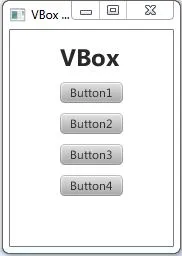

# Interfaces graphiques JavaFX

Jusqu'à présent vous avez vu comment faire des programmes qui affichent du texte
dans la console et demandent des informations à l'utilisateur dans la console
également. Nous allons maintenant voir comment rendre vos programmes plus 
attrayants en utilisant la bibliothèque de composants graphiques JavaFX.

Avant d'aller plus loin, ajoutez cette URL à vos favoris car vous en aurez
besoin assez souvent : [Documentation JavaFX](https://javadoc.io/static/org.openjfx/javafx-fxml/19/index.html)

## Qu'est-ce que JavaFX ?

JavaFX est une bibliothèque de classes écrites en Java et permettant d'afficher 
du contenu dans le système de fenêtrage de Windows, Linux ou MacOS. En d'autres
termes, les composants fournis par JavaFX contiennent tout le code nécessaire 
pour dessiner des composants graphiques (bouton, champ de saisie, listes 
déroulantes ...) dans une fenêtre fournie par l'OS.

JavaFX contient 6 modules plus ou moins inter-dépendants sur lesquels nous 
reviendrons en détail plus tard :  


## Y a-t-il d'autres bibliothèques que JavaFX ?

Oui ! La première bibliothèque graphique en Java s'appelait AWT. Cette
bibliothèque s'appuyait essentiellement sur les composants natifs du système
d'exploitation sous-jacent.

Il existe aussi Swing qui est sans doute la bibliothèque historiquement la plus 
utilisée dans le monde Java. Les composants JavaFX sont arrivés assez 
tardivement et pendant ce temps des millions d'applications ont été écrites en
Swing. C'est un système assez puissant basé sur AWT mais parfois trop technique 
à utiliser. Il faut néanmoins privilégier Swing si votre client vous le demande 
explicitement ou bien lorsque vous devrez réaliser des choses qui sortent
vraiment de l'ordinaire. 

JavaFX est donc plus simple à prendre en mains, plus cohérent également, mais
il ne faut pas pour autant oublier Swing (et lui-même repose sur AWT).
Par expérience, vous verrez qu'on ne peut parfois pas faire certaines choses
en JavaFX et il faudra contourner ce problème en intégrant des composants Swing
dans votre application (très mauvais idée mais parfois on ne peut pas faire
autrement).

### Autres librairies ?

Notez qu'il existe aussi des librairies de type **OpenGL** pour Swing ou pour 
JavaFX. Mais ce sont plutôt des surcouches à Swing et JavaFX. On utilise en 
général des librairies OpenGL pour faire des jeux vidéos ou bien des 
applications scientifiques qui nécessitent de pouvoir programmer directement
la carte graphique pour traiter de gros volumes de données.


## Exemple d'application JavaFX

Une application JavaFX est une classe Java qui hérite de la classe 
`javafx.application.Application`. Il y a cependant quelques règles à respecter 
quand on veut écrire une classe qui hérite de `Application` :

1. La classe doit donc être déclarée avec `extends javafx.application.Application`
2. La méthode `public static void main(String[] args)` doit appeler la méthode `launch()`
3. La méthode `start(Stage stage)` doit être surchargée

Exemple :
```java
import javafx.application.Application;
import javafx.stage.Stage;
import java.io.IOException;

// Une application JavaFX doit TOUJOURS hériter de la classe javafx.application.Application.
// Pour hériter d'une classe, il suffit d'ajouter "extends" après le nom de notre classe, suivi du nom de
// la classe dont on veut hériter.
//
public class HelloApplication extends Application 
{
    // Ensuite, comme dans toutes les applications il faut une méthode "main" pour la lancer :
    //
    public static void main(String[] args)
    {
        // Pour déclencher toute la mécanique de création de l'interface graphique
        // (qui est totalement transparente) il faut appeler la méthode "launch()" comme ceci :
        launch();
    }

    // Enfin il faut TOUJOURS écrire une méthode "start(Stage stage)" EXACTEMENT COMME CA :
    //
    public void start(Stage stage) throws IOException
    {
        stage.show();
    }
}
```

Revenons pas à pas sur notre exemple :

>```java
> import javafx.application.Application;  
> import javafx.stage.Stage;  
> import java.io.IOException;  
>```
Déclaration des imports : on déclare qu'on va utiliser des classes qui ne sont 
pas déclarées dans notre fichier courant. Il faut écrire le mot-clé **`import`**
suivi du nom complet de la classe qu'on veut utiliser (c'est à dire son nom
précédé de tous les noms de ses packages). Pour rappel un package est comme un
dossier sous Windows et ils peuvent donc être imbriqués les uns dans les autres.

>```java
> public class HelloApplication **extends Application**
>```
Cette partie sert à déclarer notre classe `HelloApplication` en disant qu'elle 
**hérite** de la classe `Application` (que nous avons importée plus haut).

>```java
> public static void main(String[] args) {  
>     launch();  
> }
>```
Ici c'est la partie classique de toute application Java.

>```java
> public void start(Stage stage) throws IOException {
>     stage.show();
> }
>```
Enfin la méthode start() est une méthode qui existe dans la classe Application
mais elle n'y est **pas implémentée**. C'est une méthode dite **abstraite**. 
Cette technique est très utilisée dans la programmation orientée objets (POO). 
Quand une méthode est abstraite, c'est aux sous-classes (donc notre classe) de 
la définir. Ici ce que doit faire la méthode `start()`, c'est afficher la 
fenêtre de notre application car jusqu'à présent elle n'était pas visible.

Maintenant nous allons voir comment ajouter du contenu à notre fenêtre.


## Ajouter du contenu à une fenêtre

### Les *layouts managers* et les *containers*

Que ce soit en AWT, Swing ou en JavaFX, il faut toujours ajouter un composant 
dans ce qu'on appelle un gestionnaire de présentation ou **layout manager**.
Un *LayoutManager* est une classe qui est responsable de placer vos composants
dans la zone qu'il est censé gérer. Il va donc leur attribuer une taille et une
position qui vont dépendre des caractéristiques propres à chaque type de 
*LayoutManager*.

Un **container** est un composant qui peut contenir d'autres composants. 
En Java vous verrez souvent que ces conteneurs s'appele `XxxPane` ou `XxxPanel`.

En Swing on fait la distinction entre un conteneur et un *LayoutManager* mais en 
JavaFX on parlera abusivement de *LayoutManager* pour désigner des 
conteneurs. En JavaFX il n'existe que les conteneurs, chacun ayant sa façon 
d'organiser les composants qu'on lui ajoute.

#### BorderPane
Le *layout* le plus communément utilisé est sans doute le `BorderPane` 
(BorderPanel en Swing) qui contiendra 5 composants au maximum :


#### GridPane

Si votre interface graphique est organisée en quadrillage avec des rowspan et
des colspan comme en HTML, vous obterez pour l'utilisation d'un `GridPane` :


#### FlowLayout

Si vous voulez ajouter vos composants les uns à la suite des autres, utilisez 
un `FlowLayout`. Ce layout va automatiquement faire revenir vos composants à la
ligne suivante si la fenêtre est redimensionnée à une taille trop petite pour
afficher tout sur une même ligne.

#### HBox et VBox

Less *layouts* `HBox` et `VBox` servent à placer vos composants à la suite 
mais horizontalement (`HBox`) ou verticalement (`VBox`) en créant des cases de 
même taille pour chaque widget.



#### Les autres layouts

D'autres *layouts* sont disponibles pour traiter des cas plus particuliers, 
allez voir [ici](https://javadoc.io/static/org.openjfx/javafx-fxml/19/javafx.graphics/javafx/scene/layout/package-summary.html).

### Les composants graphiques / Widgets / Gadgets

Un composant graphique peut être beaucoup de choses : 
- un contrôle de formulaire (liste déroulante, bouton, champ de saisie...)
- un gadget (une horloge animée avec 2 aiguilles par exemple)
- un dessin ou une vidéo 
...etc.

Un **gadget** est un assemblage de plusieurs composants graphiques simples dans
un même conteneur.

Les composants les plus utilisés sont ceux du module `javafx.controls` et dont
vous pourrez trouver une documentation [ici](https://docs.oracle.com/javafx/2/ui_controls/jfxpub-ui_controls.htm).


### Allons-y pour un exemple !

Pour réaliser la fenêtre suivante composée de 5 boutons, voici comment modifier 
notre méthode `start()` vue au début :

```java
public void start(Stage stage) throws IOException
{
	// Un "Stage" est toujours composé d'un composant principal (qui
	// pourra à son tour contenir plein d'autres composants). Ce composant principal
	// est appelé "RACINE" (root component). Ici je le nomme "root" volontairement
	// car c'est plus parlant mais vous pouvez choisir le nom qui vous plaît...
	BorderPane root = new BorderPane();
	
	// Création des boutons
	Button bTop = new Button("Top Button");
	Button bLeft = new Button("Left Button");
	Button bRight = new Button("Right Button");
	Button bBottom = new Button("Bottom Button");
	Button bCenter = new Button("Center Button");

	// Ici on précise qu'on souhaite que les boutons prennent la taille maximale
	HBox.setHgrow(bTop,Priority.ALWAYS);
	HBox.setHgrow(bLeft,Priority.ALWAYS);
	HBox.setHgrow(bRight,Priority.ALWAYS);
	HBox.setHgrow(bBottom,Priority.ALWAYS);
	HBox.setHgrow(bCenter,Priority.ALWAYS);
	
	// On précise également que les boutons ont une taille maximum très grande
	// sinon ils ne pourront pas s'agrandir en même temps que leur conteneur
	bTop.setMaxSize(Double.MAX_VALUE, Double.MAX_VALUE);
	bLeft.setMaxSize(Double.MAX_VALUE, Double.MAX_VALUE);
	bRight.setMaxSize(Double.MAX_VALUE, Double.MAX_VALUE);
	bBottom.setMaxSize(Double.MAX_VALUE, Double.MAX_VALUE);
	bCenter.setMaxSize(Double.MAX_VALUE, Double.MAX_VALUE);

	// O place chaque bouton à la bonne place dans le conteneur racine
	root.setTop(bTop);
	root.setLeft(bLeft);
	root.setRight(bRight);
	root.setBottom(bBottom);
	root.setCenter(bCenter);

	// On doit ensuite créer une Scene contenant notre composant racine comme ceci :
	Scene scene = new Scene(root, 360, 100);

	// On modifie le titre de notre fenêtre
	stage.setTitle("");

	// On donne notre Scene au Stage principal et on affiche le Stage :
	stage.setScene(scene);
	stage.show();
}
```

## Pour aller plus loin

- [Initiation à Swing avec des tutoriels vidéos](https://koor.fr/Java/TutorialSwing/Index.wp)