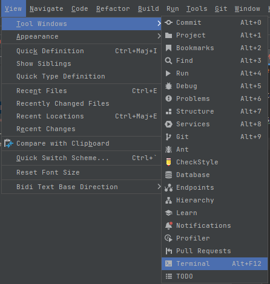
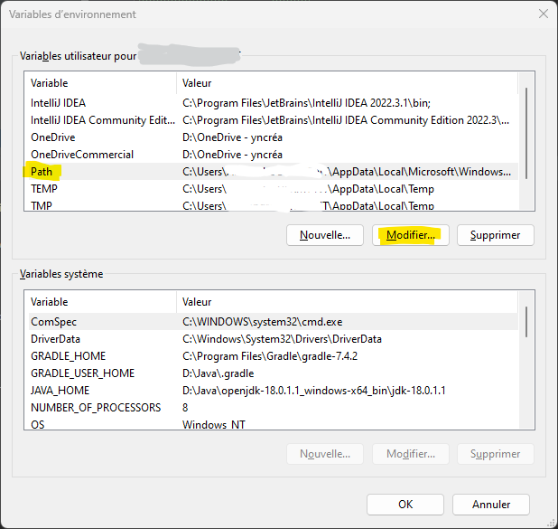
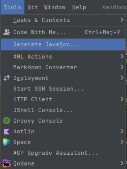
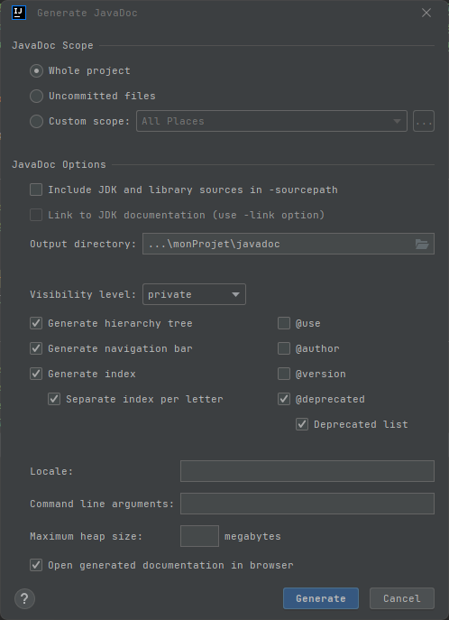
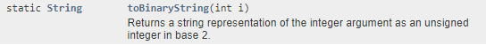
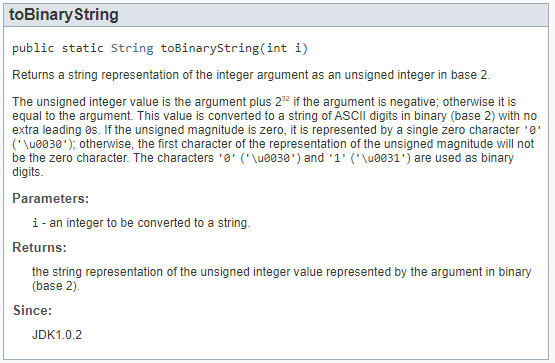

# Javadoc

> Ce cours n'est qu'un petit aperçu des bases de Javadoc, la documentation officielle et complète est ici :  
> [https://www.oracle.com/technical-resources/articles/java/javadoc-tool.html](https://www.oracle.com/technical-resources/articles/java/javadoc-tool.html)

Quand vous écrivez une classe, il faut la documenter pour décrire comment 
elle fonctionne et savoir comment utiliser les différentes méthodes qui la 
composent.

Pour écrire la documentation d'une classe Java, il existe un standard qui 
s'appelle "Javacoc". En réalité, `javadoc` est l'outil qui vous permet de 
générer la documentation de vos classes en ligne de commande dans un Terminal.

Mais c'est également l'ensemble des règles qui régissent la manière dont on doit 
écrire les commentaires de notre code pour qu'ils soient interprétables par
l'outil `javadoc`.

> **NOTE** : `javadoc` ne sert à documenter que les éléments publics du code.
> Si une variable/méthode/classe est privée ou protected, elle n'apparaîtra 
> pas dans la documentation HTML générée par l'outil. 


## La commande `javadoc`

Dans IntelliJ, ouvrez le volet "Terminal" (View > Tools > Terminal) :



> **Note** : ne tapez jamais le premier caractère `$` au début d'une ligne de 
> commande. Il s'agit d'une convention qu'on utilise pour indiquer qu'il
> s'agit d'une commande à taper dans un Terminal mais il ne fait pas partie 
> de la commande à taper.

### Etape 1 : vérifications

Vérifiez que votre variable d'environnement `Path` contient bien le chemin
complet vers le dossier `bin` de votre JDK :

> Terminal en version **PowerShell** :
> `$ echo $env:path`

> Terminal en version **Invite de commandes** :
> `$ echo %path%`

**Exemple de résultat attendu :**

C:\WINDOWS\system32;C:\WINDOWS;C:\WINDOWS\System32\WindowsPowerShell\v1.0\;
C:\WINDOWS\System32\OpenSSH\;
C:\Program Files\Git\cmd;
**D:\Java\openjdk-18.0.1.1_windows-x64_bin\jdk-18.0.1.1\bin;**
C:\Program Files\JetBrains\IntelliJ IDEA 2022.3.1\bin;

Si vous ne voyez pas votre répertoire JDK, éditez votre variable d'environnement
PATH pour y ajouter le chemin vers votre JDK.

- Pour aller plus vite, recopiez cette commande dans votre Terminal :

   >`$ rundll32 sysdm.cpl,EditEnvironmentVariables`

- Vous allez voir cette fenêtre :

   

- Sélectionnez la variable `Path`, cliquez sur `Modifier` et ajoutez le chemin
complet vers votre JDK (recopiez bien tout le chemin jusqu'au dossier `bin` de 
votre JDK !)

- **Relancez ensuite IntelliJ.**

- Puis tapez la commande suivante pour vérifier que la commande `javadoc` est 
maintenant accessible :

> `$ javadoc --version`  
>
> `> javadoc 18.0.0.1`

### Etape 2 : générer la doc des classes au format HTML avec `javadoc`

- Lorsque la commande `javadoc` fonctionne, relancez-la comme ci-après pour 
générer toute la documentation de votre projet courant :

   > `$ javadoc -d javadoc src/*`
   >
   > **Note** : L'option `-d` sert à indiquer le répertoire dans lequel vous 
   souhaitez générer les fichiers HTML. Le caractère `*` est un caractère joker 
   qui signifie "n'importe quelle chaine de caractères". Comme ce qui est 
   attendu est un nom de fichier, la commande prendra en compte tous les 
   fichiers qui sont dans le répertoire `src`.

- Si la commande a bien fonctionné, vous verez un nouveau dossier `javadoc` créé
par la commande précédente. Il contient toute l'arborescence des fichiers HTML
pour documenter votre classe.

- Affichez le fichier `javadoc/index.html` dans votre navigateur (clic droit
sur le fichier puis `Open in > Browser > Default`).

- Vous pouvez également utiliser le menu `Tools > Generate javadoc ...` :  

  



Voyons maintenant que mettre dans vos commentaires pour bien documenter vos 
classes !

## Les règles générales pour écrire des commentaires Javadoc

1. Un commentaire `javadoc` commence par `/**` et se termine par `*/`.

2. Le texte d'un commentaire `javadoc` doit être écrit en **HTML**. Ca ne vous 
empêche pas de ne jamais mettre de balises HTML car du texte brut est du HTML
valide ;) Si vous voulez mettre du texte en gras, mettez-le entre des balises 
\<strong\> **et** \</strong\> par exemple.

3. Un commentaire `javadoc` doit être placé **DEVANT** l'élément
qu'il documente. C'est à dire que pour documenter une classe, le commentaire
doit être placé juste avant la ligne de déclaration de la classe :

	```java
	/**
	 * Ce commentaire résume ce que fait la classe.
	 */
	public class MyClass { ...
	```

   Pour documenter une constante **publique** de la classe, idem :

	```java
	/** Ce commentaire décrit à quoi servira la constante. */
	public static final int MA_CONSTANTE = 42;
	```
4. On ne peut documenter que des classes, des méthodes ou des variables membres
d'une classe. Les commentaires Javadoc écrits à l'intérieur d'une méthode sont
ignorés car le rôle de la javadoc est simplement de décrire le **contrat 
d'interface** entre votre classe et les utilisateurs de votre classe.

5. L'outil `javadoc` traite tout ce qui se trouve entre le tag et le premier 
caractère point '.' comme un **résumé** de l'élément que vous documentez. Donc
si vous écrivez un commentaire de 3km, n'oubliez pas d'en faire un résumé et 
de finir votre phrase par un point :

	```java
	/**
	 * Ceci est le résumé de la méthode, mettez un point quand c'est fini.
	 * 
	 * Ensuite si la méthode est vraiment compliquée ou fait des traitements 
	 * bizarres, il faut prévenir l'utilisateur. Il est aussi important de bien 
	 * mettre des exemples d'utilisation lorsque la méthode fait beaucoup de 
	 * choses pour aider à sa compréhension.
	 * <p>
	 * N'oubliez pas que vous avez le droit de mettre en forme votre texte
	 * en HTML ! Par conséquent les caractères inférieur "&lt;" et supérieur
	 * "&gt;" sont interdits sauf pour écrire des balises HTML valides.
	 * </p>
	 * <pre>
	 * // Vous pouvez même mettre des exemples de code pour décrire comment 
	 * // utiliser votre méthode :)
	 * String s = myMethod();
	 * 
	 * <ET ICI VOUS METTEZ LES TAGS JAVADOC> (rdv au chapitre suivant !)
	 */
	public String myMethod() { ...
	```
	
	Regardez comment apparaît la méthode `Integer.toBinaryString()` dans la 
	section "Method summary" de la [documentation officielle](https://docs.oracle.com/en/java/javase/19/docs/api/java.base/java/lang/Integer.html) :
	
	
	
	Et voici maintenant la même méthode mais dans la section "Method details" :  
	
	


## Les tags javadoc

Un tag javadoc est une balise qui commence par un `@` et est suivie par une 
valeur. Il existe des tags qui se mettent dans les commentaires d'entête des 
fichiers pour documenter le package, des tags prévus pour documenter la classe, 
des tags pour documenter les paramètres des méthodes ...etc.

```java
/**
 * Exemple de commentaire javadoc. Remplacez <TAG> et <VALEUR_DU_TAG> par des
 * vrais tags et des vraies valeurs ;)
 *
 * @<TAG> <VALEUR_DU_TAG>
 */
```

### Les tags d'une classe

| Tag          | Description                                             |
|--------------|---------------------------------------------------------|
| `@version`     | Décrit la date de création du fichier ou sa version.    |
| `@author`      | Décrit le nom de l'auteur de la classe.                 |
| `@see`         | Décrit une classe en lien avec la nôtre et qui peut aider à sa compréhension.|

Exemple :

```java
/**
 * MyClass is a class designed to blah blah........
 *
 * @date   23/01/2023
 * @author Some Name or Pseudonym
 * @see    otherpackage.OtherClass
 */
public class MyClass { ...
```

### Les tags d'une méthode

Les commentaires les plus importants sont ceux des méthodes de votre classe. 

| Tag              | Description                                        |
|------------------|----------------------------------------------------|
| `@param <nom>`   | Décrit un paramètre attendu par la méthode.        |
| `@return`        | Décrit ce que retourne la méthode.                 |

Exemple :

```java
/**
 * Cette méthode fait la moyenne des valeur d'un tableau de double[].
 *
 * @param tab Le tableau des valeurs dont on cherche à calculer la moyenne.
 * @return La moyenne des valeurs du tableau 'tab'.
 */
public class MyClass { ...
```


### Les tags un peu spéciaux ...


Dans un commentaire javadoc, on met parfois des liens internes vers la page de 
documentation courante ou vers une autre page d'une autre classe. Voici comment
mettre des liens, qu'ils soient internes ou externes :

- Pour une méthode "methodeInterne(int a, int b)" par exemple :  

```java
/**
 * Allez jeter un oeil à {@link #methodeInterne(int,int) cette méthode}
 */
```

- Pour une méthode "methodeExterne()" par exemple :  

```java
/**
 * Allez jeter un oeil à {@link autrepackage.AutreClasse#methodeExterne() cette méthode}
 */
```
